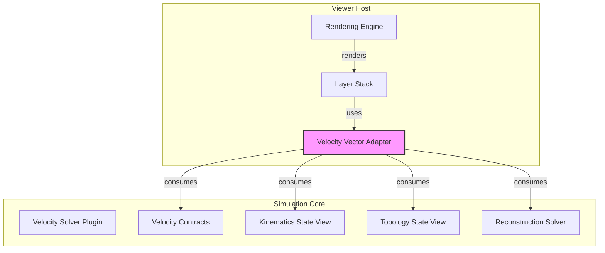
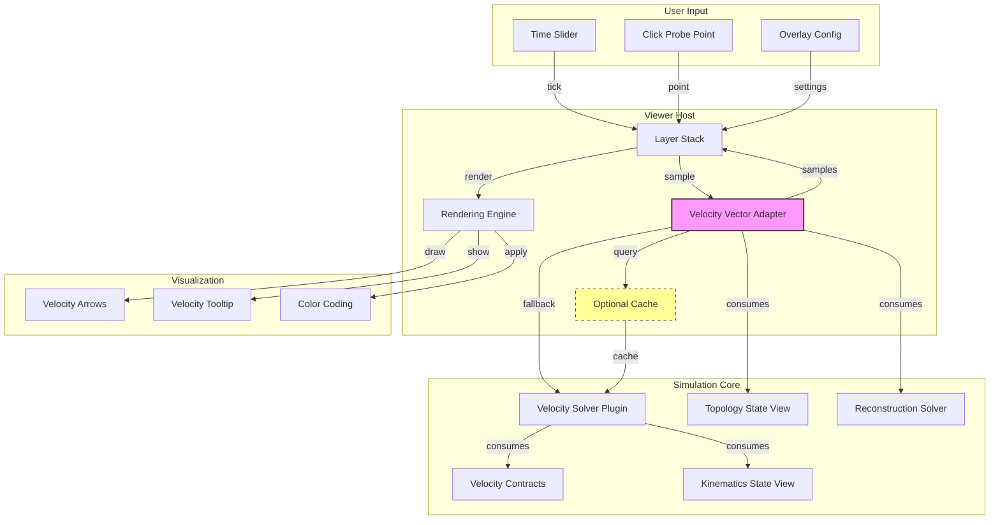
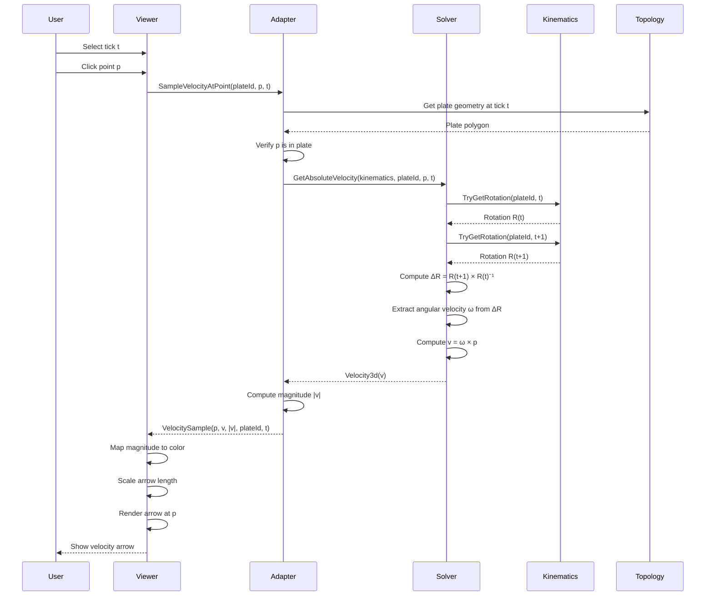

# Viewer Integration Adapter for RFC-V2-0033 Velocity Solver

**Date**: 2026-01-28
**Topic**: Thin adapter pattern for integrating velocity solver outputs with RFC-0027 viewer
**Status**: Planning (Not Implemented)

---

## 1. Executive Summary

This document outlines the design for a **thin adapter** that integrates the RFC-V2-0033 plate velocity solver with the RFC-0027 plate reconstruction viewer. The adapter enables visualization of plate velocities as vector overlays without re-deriving velocity from first principles.

**Key Principles**:
- **Thin integration**: Adapter delegates to existing solver, no velocity recomputation
- **Derived outputs**: Viewer consumes derived velocity products, never becomes truth
- **Deterministic**: Same inputs produce identical visualizations
- **Cache-friendly**: Supports optional caching for performance

---

## 2. Context

### 2.1 Velocity Solver Implementation (RFC-V2-0033)

The velocity solver is **complete** in `fantasim-world` and provides:

| Method | Purpose | Output |
|--------|---------|--------|
| `GetAbsoluteVelocity(kinematics, plateId, point, tick)` | Absolute velocity at point | `Velocity3d` (body-frame units/tick) |
| `GetRelativeVelocity(kinematics, plateIdA, plateIdB, point, tick)` | Relative velocity between plates | `Velocity3d` (vA - vB) |
| `GetAngularVelocity(kinematics, plateId, tick)` | Angular velocity of plate | `AngularVelocity3d` (radians/tick) |

**Implementation**: `FiniteRotationPlateVelocitySolver` in `Geosphere.Plate.Velocity.Solver` plugin.

### 2.2 Viewer Specification (RFC-0027)

The viewer MVP requires:
- Time slider for tick selection
- Layer stack for vector/raster overlays
- Consumption of topology and kinematics truth via materialized read models
- Consumption of derived reconstruction solvers
- Deterministic output for fixed input snapshot

**Integration Point**: Velocity vectors as an optional vector overlay layer.

---

## 3. Adapter Architecture

### 3.1 Component Placement

**Recommended**: Create adapter as a **viewer-side integration layer** in the viewer host project (e.g., `fantasim-app-window` or similar UI host).

**Rationale**:
- Viewer host owns the layer stack and rendering pipeline
- Adapter is UI-specific (visualization concerns), not core simulation logic
- Keeps `fantasim-world` focused on simulation contracts
- Allows different viewer hosts to have different visualization strategies

**Alternative** (if viewer host is not yet created):
- Create a `Geosphere.Plate.Velocity.ViewerAdapters` contracts project in `fantasim-world`
- Define adapter interfaces that viewer hosts can implement
- Provides clear separation between simulation and visualization

### 3.2 Dependency Graph



### 3.3 Adapter Dependencies

| Dependency | Purpose | Layer |
|------------|---------|-------|
| `IPlateVelocitySolver` | Query velocity at points | Contracts (T1) |
| `IPlateKinematicsStateView` | Get kinematics state | Derived (T2) |
| `IPlateTopologyStateView` | Get topology (plates, boundaries) | Derived (T2) |
| `IPlateReconstructionSolver` | Get reconstructed boundaries | Plugin (T3) |
| `Velocity3d`, `AngularVelocity3d` | Value types for output | Contracts (T1) |

**No additional dependencies required** - adapter uses existing contracts.

---

## 4. Adapter Design

### 4.1 Core Interface

```csharp
/// <summary>
/// Adapter for querying velocity samples for viewer visualization.
/// </summary>
public interface IVelocityVectorAdapter
{
    /// <summary>
    /// Samples velocity at a single point.
    /// </summary>
    /// <param name="plateId">Plate the point is anchored to.</param>
    /// <param name="point">Point in body frame at target tick.</param>
    /// <param name="tick">Target tick.</param>
    /// <returns>Velocity vector at the point.</returns>
    VelocitySample SampleVelocityAtPoint(
        PlateId plateId,
        Vector3d point,
        CanonicalTick tick);

    /// <summary>
    /// Samples velocities at multiple points (batch for efficiency).
    /// </summary>
    /// <param name="plateId">Plate the points are anchored to.</param>
    /// <param name="points">Points in body frame at target tick.</param>
    /// <param name="tick">Target tick.</param>
    /// <returns>Velocity vectors at each point.</returns>
    IReadOnlyList<VelocitySample> SampleVelocitiesAtPoints(
        PlateId plateId,
        IReadOnlyList<Vector3d> points,
        CanonicalTick tick);

    /// <summary>
    /// Gets angular velocity for a plate (useful for rotation visualization).
    /// </summary>
    /// <param name="plateId">Plate.</param>
    /// <param name="tick">Target tick.</param>
    /// <returns>Angular velocity of the plate.</returns>
    AngularVelocity3d GetAngularVelocity(
        PlateId plateId,
        CanonicalTick tick);
}
```

### 4.2 Output Data Structures

```csharp
/// <summary>
/// Velocity sample at a point for visualization.
/// </summary>
public readonly record struct VelocitySample(
    Vector3d Point,           // Sample point (body frame)
    Velocity3d Velocity,        // Velocity vector
    double Magnitude,            // Speed (for color coding)
    PlateId PlateId,            // Provenance
    CanonicalTick Tick           // Temporal context
);

/// <summary>
/// Velocity vector overlay configuration.
/// </summary>
public record VelocityOverlayConfig(
    bool ShowAbsoluteVelocity = true,
    bool ShowRelativeVelocity = false,
    PlateId? RelativeReferencePlate = null,
    bool ShowAngularVelocity = false,
    double VectorScale = 1.0,          // Scaling factor for arrow length
    double ColorScaleMin = 0.0,         // Minimum speed for color gradient
    double ColorScaleMax = 100.0,        // Maximum speed for color gradient
    int SamplingDensity = 1               // Points per boundary segment
);
```

### 4.3 Implementation Class

```csharp
/// <summary>
/// Thin adapter that delegates to IPlateVelocitySolver.
/// </summary>
public sealed class VelocityVectorAdapter : IVelocityVectorAdapter
{
    private readonly IPlateVelocitySolver _velocitySolver;
    private readonly IPlateKinematicsStateView _kinematics;
    private readonly IPlateTopologyStateView _topology;

    public VelocityVectorAdapter(
        IPlateVelocitySolver velocitySolver,
        IPlateKinematicsStateView kinematics,
        IPlateTopologyStateView topology)
    {
        _velocitySolver = velocitySolver;
        _kinematics = kinematics;
        _topology = topology;
    }

    public VelocitySample SampleVelocityAtPoint(
        PlateId plateId,
        Vector3d point,
        CanonicalTick tick)
    {
        var velocity = _velocitySolver.GetAbsoluteVelocity(
            _kinematics, plateId, point, tick);

        return new VelocitySample(
            Point: point,
            Velocity: velocity,
            Magnitude: velocity.Magnitude(),
            PlateId: plateId,
            Tick: tick);
    }

    public IReadOnlyList<VelocitySample> SampleVelocitiesAtPoints(
        PlateId plateId,
        IReadOnlyList<Vector3d> points,
        CanonicalTick tick)
    {
        var samples = new List<VelocitySample>(points.Count);

        foreach (var point in points)
        {
            samples.Add(SampleVelocityAtPoint(plateId, point, tick));
        }

        return samples;
    }

    public AngularVelocity3d GetAngularVelocity(
        PlateId plateId,
        CanonicalTick tick)
    {
        return _velocitySolver.GetAngularVelocity(_kinematics, plateId, tick);
    }
}
```

---

## 5. Integration Points

### 5.1 Sampling Points

#### 5.1.1 Plate Centroids

**Challenge**: Plate entity has no geometry (only `PlateId`, `IsRetired`, `RetirementReason`).

**Solution**: Use reconstructed boundaries to compute centroids.

**Approach**:
1. Query `IPlateReconstructionSolver.ReconstructBoundaries(topology, kinematics, tick)`
2. Filter boundaries by `PlateIdProvenance`
3. Compute centroid from boundary geometries using `IGeometry.Centroid()`
4. Sample velocity at centroid points

**Alternative** (if reconstruction not available):
- Sample at boundary midpoints instead of centroids
- Provides representative velocity samples without centroid computation

#### 5.1.2 User Probe Points

**User Interaction**: Viewer allows user to click anywhere on the globe to probe velocity.

**Implementation**:
1. User clicks → viewer captures screen coordinates
2. Viewer unprojects to body-frame point (using camera transform)
3. Adapter determines which plate contains the point:
   - Use `IPlateTopologyStateView` to get all active plates
   - Query reconstruction solver to get plate polygons at tick
   - Point-in-polygon test to find containing plate
4. Adapter samples velocity at the point

**Fallback**: If point is outside any plate (e.g., ocean), return zero velocity or skip.

#### 5.1.3 Boundary Points

**Purpose**: Visualize velocity along plate boundaries (e.g., for convergence/divergence analysis).

**Implementation**:
1. Get reconstructed boundaries at tick
2. Sample along each boundary geometry:
   - For lines: sample at regular intervals (configurable density)
   - For polygons: sample along edges
3. For each sample point:
   - Determine which plate to query (left or right plate)
   - Sample absolute velocity on that plate
   - Optionally sample relative velocity between left/right plates

**Visualization**: Color-code by convergence (negative relative velocity) or divergence (positive).

### 5.2 Visualization Approach

#### 5.2.1 Vector Arrows

**Representation**: 3D arrows anchored at sample points.

**Arrow Geometry**:
- Origin: Sample point on globe surface
- Direction: Velocity vector direction
- Length: Scaled by `VectorScale` × `Magnitude`
- Arrowhead: Standard cone geometry

**Color Coding**:
- Map magnitude to color gradient (e.g., blue → green → red)
- Use `ColorScaleMin` and `ColorScaleMax` for gradient bounds
- Zero velocity: gray or invisible

**Units Display**:
- Internal: body-frame units/tick (from solver)
- UI: Convert to display units (e.g., cm/year) for labels
- Conversion factor: `displayUnitsPerTick` (configurable per body)

#### 5.2.2 Angular Velocity Visualization

**Representation**: Rotation axis arrows at plate centroids.

**Arrow Geometry**:
- Origin: Plate centroid
- Direction: Angular velocity axis (unit vector)
- Length: Scaled by angular rate (radians/tick)
- Arrowhead: Different color/style to distinguish from linear velocity

**Alternative**: Use curved arrows around plate boundaries to show rotation direction.

#### 5.2.3 Relative Velocity Visualization

**Representation**: Arrows showing relative motion between adjacent plates.

**Implementation**:
- Sample points along shared boundaries
- Query `GetRelativeVelocity(kinematics, plateIdA, plateIdB, point, tick)`
- Color-code by convergence (negative) vs divergence (positive)
- Magnitude indicates relative speed

**Use Cases**:
- Identify subduction zones (high convergence)
- Identify spreading centers (high divergence)
- Visualize transform faults (shear motion)

---

## 6. Performance Considerations

### 6.1 Caching Strategy

#### 6.1.1 Cache Key

```csharp
public readonly record struct VelocityCacheKey(
    PlateId PlateId,
    Vector3d Point,
    CanonicalTick Tick,
    TruthStreamIdentity StreamIdentity  // For stream isolation
);
```

#### 6.1.2 Cache Invalidation

**Invalidate on**:
- Tick change (time slider moves)
- Stream identity change (different simulation instance)
- Topology event sequence change (truth updated)

**Cache Scope**:
- Per-viewer instance (not global)
- Respect stream isolation (RFC-0027 §4)
- Must be invalidatable (RFC-0027 §4)

#### 6.1.3 Cache Implementation Options

**Option 1: Simple Dictionary Cache**
```csharp
private readonly ConcurrentDictionary<VelocityCacheKey, Velocity3d> _cache;

public Velocity3d GetAbsoluteVelocity(
    PlateId plateId,
    Vector3d point,
    CanonicalTick tick)
{
    var key = new VelocityCacheKey(plateId, point, tick, _kinematics.Identity);

    return _cache.GetOrAdd(key, _ =>
        _velocitySolver.GetAbsoluteVelocity(_kinematics, plateId, point, tick));
}
```

**Option 2: LRU Cache**
- Use `ConcurrentDictionary` with size limit
- Evict least-recently-used entries when full
- Balances memory usage vs cache hit rate

**Option 3: No Cache (On-Demand)**
- Always query solver directly
- Lowest memory usage
- Acceptable if solver is fast enough

**Recommendation**: Start with Option 1 (simple cache), profile, then optimize if needed.

### 6.2 Batch Sampling

**Efficiency**: Query multiple points in single call to reduce overhead.

**Implementation**:
- Adapter provides `SampleVelocitiesAtPoints()` method
- Viewer batches sample points before calling adapter
- Reduces per-call overhead (e.g., state view queries)

**Use Cases**:
- Sampling along boundaries (many points per boundary)
- Sampling at grid points (for heatmap visualization)
- Sampling at multiple user probe points

### 6.3 Solver Performance

**FiniteRotationPlateVelocitySolver Complexity**:
- `GetAngularVelocity`: O(1) - queries rotation at two ticks
- `GetAbsoluteVelocity`: O(1) - queries angular velocity + cross product
- `GetRelativeVelocity`: O(1) - two absolute velocity queries

**Expected Performance**:
- Very fast (microseconds per query)
- Caching provides minimal benefit for individual queries
- Batching is more important than caching for boundary sampling

**Recommendation**:
- Cache only if profiling shows bottleneck
- Prioritize batch sampling over caching
- Profile with realistic data (many plates, many sample points)

---

## 7. API Surface Summary

### 7.1 Public Interface

| Method | Purpose | Returns |
|--------|---------|---------|
| `SampleVelocityAtPoint(plateId, point, tick)` | Sample at single point | `VelocitySample` |
| `SampleVelocitiesAtPoints(plateId, points, tick)` | Batch sample | `IReadOnlyList<VelocitySample>` |
| `GetAngularVelocity(plateId, tick)` | Get plate rotation | `AngularVelocity3d` |

### 7.2 Configuration

| Property | Default | Purpose |
|----------|---------|---------|
| `ShowAbsoluteVelocity` | `true` | Show absolute velocity arrows |
| `ShowRelativeVelocity` | `false` | Show relative velocity at boundaries |
| `RelativeReferencePlate` | `null` | Reference plate for relative velocity |
| `ShowAngularVelocity` | `false` | Show angular velocity arrows |
| `VectorScale` | `1.0` | Arrow length scaling factor |
| `ColorScaleMin` | `0.0` | Minimum speed for color gradient |
| `ColorScaleMax` | `100.0` | Maximum speed for color gradient |
| `SamplingDensity` | `1` | Points per boundary segment |

### 7.3 Output Format

**VelocitySample**:
```csharp
{
    Point: Vector3d,           // Sample location
    Velocity: Velocity3d,       // Velocity vector (X, Y, Z)
    Magnitude: double,          // Speed (for color coding)
    PlateId: PlateId,           // Provenance
    Tick: CanonicalTick         // Temporal context
}
```

**Visualization Mapping**:
- Arrow origin: `Point`
- Arrow direction: `Velocity` normalized
- Arrow length: `VectorScale` × `Magnitude`
- Arrow color: Map `Magnitude` to gradient [ColorScaleMin, ColorScaleMax]

---

## 8. Implementation Steps

### Phase 1: Core Adapter (MVP)

1. **Create adapter interface** (`IVelocityVectorAdapter`)
   - Define `SampleVelocityAtPoint()` method
   - Define `GetAngularVelocity()` method

2. **Implement adapter class** (`VelocityVectorAdapter`)
   - Inject `IPlateVelocitySolver`, `IPlateKinematicsStateView`, `IPlateTopologyStateView`
   - Delegate to solver methods
   - Return `VelocitySample` structs

3. **Add to viewer layer stack**
   - Register adapter with viewer host
   - Wire up dependencies (solver, state views)
   - Implement basic vector arrow rendering

4. **Test with sample points**
   - Manually create sample points
   - Verify velocity computation
   - Verify arrow rendering

### Phase 2: Boundary Sampling

1. **Implement boundary point sampling**
   - Query reconstructed boundaries
   - Sample along boundary geometries
   - Call `SampleVelocitiesAtPoints()` for batch

2. **Add boundary visualization**
   - Render arrows along boundaries
   - Color-code by magnitude
   - Add relative velocity option

3. **Test with real topology**
   - Load sample dataset
   - Verify boundary sampling
   - Verify convergence/divergence visualization

### Phase 3: User Interaction

1. **Implement point-in-polygon test**
   - Determine plate for user probe point
   - Use reconstructed plate polygons
   - Handle edge cases (outside all plates)

2. **Add probe point UI**
   - Click-to-probe interaction
   - Display velocity tooltip
   - Show probe point marker

3. **Test user workflow**
   - Verify click detection
   - Verify velocity display
   - Verify performance with many probes

### Phase 4: Performance Optimization

1. **Profile current implementation**
   - Measure query time per point
   - Identify bottlenecks
   - Determine if caching is needed

2. **Add caching (if needed)**
   - Implement cache with invalidation
   - Profile cache hit rate
   - Tune cache size

3. **Optimize batch sampling**
   - Ensure viewer batches queries
   - Measure batch vs individual overhead
   - Tune batch sizes

---

## 9. Future Work Items

### 9.1 Full Vector Overlay Layer

**Enhanced Visualization**:
- Heatmap visualization of velocity magnitude
- Streamlines showing flow patterns
- Animation of velocity over time
- 3D volumetric visualization (if applicable)

**Advanced Features**:
- Velocity interpolation between ticks
- Temporal smoothing (reduce jitter)
- Multi-tick comparison (show velocity change)
- Export velocity data (CSV, GeoJSON)

### 9.2 Stage-Level Velocity

**RFC-V2-0033 Enhancement**:
- Implement `IStageVelocitySolver` interface
- Query velocity at stage boundaries
- Visualize stage-level motion patterns

### 9.3 Integration with Other Derived Products

**Combine with**:
- Stress/strain tensors (if implemented)
- Plate deformation (if implemented)
- Heat flow (if implemented)

**Goal**: Multi-layer visualization showing relationships between derived products.

### 9.4 Solver Lab Integration

**Validation**:
- Use velocity solver in Solver Lab corpus
- Verify deterministic outputs
- Compare against reference implementations
- Benchmark performance

---

## 10. Design Decisions

### 10.1 Adapter Placement

**Decision**: Adapter lives in viewer host project, not `fantasim-world`.

**Rationale**:
- Visualization is UI-specific, not core simulation
- Different viewer hosts may have different rendering strategies
- Keeps `fantasim-world` focused on simulation contracts
- Follows separation of concerns (simulation vs presentation)

**Trade-off**:
- Requires viewer host to depend on velocity contracts
- Cannot share adapter implementation across hosts
- Mitigated by defining adapter interfaces in contracts layer

### 10.2 Sampling Strategy

**Decision**: Use reconstructed boundaries for centroid computation, not raw topology.

**Rationale**:
- Reconstructed boundaries are at target tick (correct temporal context)
- Raw topology boundaries are at reference tick (wrong temporal context)
- Viewer already uses reconstruction solver for boundary rendering
- Ensures velocity and geometry are temporally aligned

**Alternative** (if reconstruction not available):
- Sample at boundary midpoints from raw topology
- Transform points to target tick using kinematics
- More complex but avoids reconstruction dependency

### 10.3 Caching Approach

**Decision**: Start with simple dictionary cache, optimize if needed.

**Rationale**:
- Velocity solver is fast (microseconds per query)
- Caching adds complexity (invalidation, memory management)
- Premature optimization is evil
- Profile first, then optimize

**Future Enhancement**:
- If profiling shows bottleneck, add LRU cache
- Consider caching reconstructed geometries (more expensive)
- Cache angular velocity per plate (often reused)

### 10.4 Point Frame Semantics

**Decision**: Adapter expects points in body frame at target tick.

**Rationale**:
- Matches velocity solver contract (RFC-V2-0033 §3.4)
- Keeps adapter independent from reconstruction solver
- Caller (viewer) responsible for point transformation
- Simplifies adapter implementation

**Implication**:
- Viewer must transform user probe points to target tick
- Use reconstruction solver or kinematics for transformation
- Ensures velocity and geometry are temporally aligned

### 10.5 Zero Velocity Fallback

**Decision**: Return zero velocity when kinematics data is missing.

**Rationale**:
- Matches velocity solver fallback policy (RFC-V2-0033 §3.3)
- Matches reconstruction solver fallback policy (RFC-V2-0024)
- Allows graceful degradation in partial data scenarios
- Better than throwing exceptions (user sees nothing)

**Visualization**:
- Zero velocity → no arrow or gray arrow
- Indicates missing data to user
- Does not break visualization flow

---

## 11. Dependencies and Integration Points

### 11.1 Required Dependencies

| Project | Component | Purpose |
|---------|-----------|---------|
| `Geosphere.Plate.Velocity.Contracts` | `IPlateVelocitySolver`, `Velocity3d`, `AngularVelocity3d` | Query velocity |
| `Geosphere.Plate.Kinematics.Contracts` | `IPlateKinematicsStateView` | Get kinematics state |
| `Geosphere.Plate.Topology.Contracts` | `IPlateTopologyStateView`, `PlateId`, `Vector3d` | Get topology state |
| `Geosphere.Plate.Reconstruction.Contracts` | `IPlateReconstructionSolver`, `ReconstructedBoundary` | Get reconstructed boundaries |

### 11.2 Optional Dependencies

| Project | Component | Purpose |
|---------|-----------|---------|
| `Geosphere.Plate.Velocity.Solver` | `FiniteRotationPlateVelocitySolver` | Reference implementation |
| `UnifyGeometry` | `IGeometry`, `Centroid()` | Compute centroids |
| Rendering library (viewer-specific) | Arrow rendering, color gradients | Visualization |

### 11.3 Integration Points

1. **Viewer Host Initialization**:
   - Instantiate `VelocityVectorAdapter` with dependencies
   - Register with layer stack
   - Configure overlay settings

2. **Time Slider Change**:
   - Invalidate cache (if caching)
   - Re-sample velocities at new tick
   - Re-render vector overlay

3. **Layer Stack Rendering**:
   - Query adapter for velocity samples
   - Map samples to visual elements (arrows, colors)
   - Render overlay on top of base layers

4. **User Interaction**:
   - Handle click events
   - Determine plate for probe point
   - Query adapter for velocity
   - Display tooltip or marker

---

## 12. Testing Strategy

### 12.1 Unit Tests

**Test Adapter Behavior**:
- `SampleVelocityAtPoint_ReturnsCorrectVelocity`
- `SampleVelocityAtPoint_ReturnsZero_ForMissingKinematics`
- `SampleVelocitiesAtPoints_BatchesQueriesCorrectly`
- `GetAngularVelocity_ReturnsCorrectAngularVelocity`

**Test Cache Behavior** (if caching implemented):
- `Cache_StoresVelocityOnFirstQuery`
- `Cache_ReturnsCachedValueOnSubsequentQuery`
- `Cache_InvalidatesOnTickChange`

### 12.2 Integration Tests

**Test with Real Data**:
- Load sample dataset
- Sample at known points
- Verify velocities match expected values
- Verify visualization renders correctly

**Test User Workflow**:
- Click on globe
- Verify probe point detection
- Verify velocity display
- Verify performance with many probes

### 12.3 Solver Lab Validation

**Determinism Tests**:
- Same inputs produce same outputs
- Verify across multiple runs
- Verify across different platforms

**Benchmark Tests**:
- Measure query time per point
- Measure batch query overhead
- Profile cache hit rate (if caching)

---

## 13. Open Questions

### 13.1 Viewer Host Availability

**Question**: Does a viewer host project exist yet (e.g., `fantasim-app-window`)?

**Impact**:
- If yes: Implement adapter in viewer host
- If no: Create adapter contracts in `fantasim-world` for future use

**Recommendation**: Create adapter contracts in `fantasim-world` regardless, for reusability.

### 13.2 Centroid Computation

**Question**: Should centroid computation be part of adapter or viewer?

**Options**:
- Adapter: Provides `GetPlateCentroid(plateId, tick)` method
- Viewer: Computes centroids using reconstruction solver

**Recommendation**: Keep centroid computation in viewer, adapter only samples at provided points.

### 13.3 Angular Velocity Visualization

**Question**: How should angular velocity be visualized?

**Options**:
- Rotation axis arrows at centroids
- Curved arrows around plate boundaries
- Color-coded plates by angular rate

**Recommendation**: Start with rotation axis arrows (simplest), enhance based on user feedback.

### 13.4 Relative Velocity Reference Plate

**Question**: How should user select reference plate for relative velocity?

**Options**:
- Dropdown menu of all plates
- Click on reference plate to select
- Always use adjacent plate (for boundary visualization)

**Recommendation**: For boundary visualization, always use adjacent plate (left/right). For probe points, provide dropdown or click selection.

---

## 14. Conclusion

This plan outlines a **thin adapter pattern** for integrating the RFC-V2-0033 velocity solver with the RFC-0027 viewer. The adapter:

- Delegates to existing solver (no velocity recomputation)
- Consumes standard contracts (velocity, kinematics, topology)
- Provides simple API for viewer (`SampleVelocityAtPoint`, `GetAngularVelocity`)
- Supports flexible visualization (arrows, color coding, scaling)
- Enables performance optimization (caching, batching)

**Next Steps**:
1. Review and approve this plan
2. Implement Phase 1 (core adapter + basic visualization)
3. Iterate based on user feedback
4. Enhance with Phases 2-4 (boundary sampling, user interaction, optimization)

**Success Criteria**:
- User can view velocity vectors at probe points
- User can view velocity vectors along boundaries
- Visualization is performant and responsive
- Code is clean, testable, and maintainable

---

## Appendix A: Architecture Diagram



---

## Appendix B: Data Flow



---

## Appendix C: File Structure

```
fantasim-world/
├── project/
│   ├── contracts/
│   │   └── Geosphere.Plate.Velocity.ViewerAdapters/  (optional)
│   │       ├── IVelocityVectorAdapter.cs
│   │       ├── VelocitySample.cs
│   │       └── VelocityOverlayConfig.cs
│   └── plugins/
│       └── Geosphere.Plate.Velocity.Solver/
│           ├── FiniteRotationPlateVelocitySolver.cs
│           └── Geosphere.Plate.Velocity.Solver.csproj

viewer-host/  (e.g., fantasim-app-window)
├── adapters/
│   ├── VelocityVectorAdapter.cs
│   └── VelocityVectorAdapterTests.cs
├── layers/
│   └── VelocityVectorOverlay.cs
└── rendering/
    └── VelocityArrowRenderer.cs
```

---

*This document provides a comprehensive plan for integrating the RFC-V2-0033 velocity solver with the RFC-0027 viewer. The design follows a thin adapter pattern, delegates to existing solver contracts, and provides a clear path for implementation and future enhancements.*
